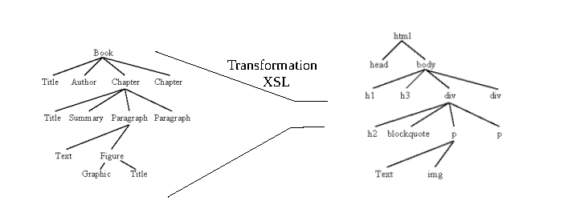

# Séance 10 : Initiation à Xpath et XSLT

---
## Construire des arbres TEI

[Mon rêve familier](img/Mon_reve_familier.png)
[Le Misanthrope](img/Misanthrope.png)

*Vous trouverez les arbres dans le sous-dossier img de la séance, dans les fichiers Mon_reve_familier.png et Misanthrope.png.*

**Attention travailler bien à partir des fichiers donnés dans le dossier de la séance pour que les corrections soient adaptées.**

---
## Initiation à Xpath

Xpath est un langage de requête. Son nom vient de *path expression*. Il permet d'exprimer un chemin dans l'arborescence d'un document XML.

Xpath 2.0 est publié par le world wide web Consortium (W3C) et s’inscrit dans le famille des standards XML. Il existe aujourd'hui une version 3 de Xpath, mais elle est encore très peu utilisée.  

Xpath a été conçu comme un langage intégré, et non pas un langage autonome. Il est conçu comme un langage-module à incorporer dans d’autres langages. 

---

La manière la plus courante d’utiliser Xpath est de l’appliquer à une source XML et de produire une liste de nœuds sélectionnés à partir de l’entrée XML comme sortie. Toutefois, il accepte également les opérations simples et les expressions régulières.


**Attention Xpath est un « read-only » langage, c’est-à-dire qu’il ne peut pas créer ou modifier un nœud existant.**

Ce langage fonctionne avec XSLT qui permet d’écrire de nouveaux documents à partir d’une source XML. Xpath est un sous langage de XSLT qui fonctionne comme un pointeur vers les éléments à sélectionner. 

---
Pour résumer :

* Xpath 2.0 est publié par le *World Wide Web Consortium* (W3C) et s’inscrit dans la famille des standards XML;

* Xpath est un langage de requêtes qui permet de parcourir un arbre XML;

* Xpath a été conçu comme un langage intégré, et non pas un langage autonome; 
	
* Xpath est un « read-only » langage. 

<br/>

Pour aller plus loin : Michael R. Kay, *XPath 2.0 programmer’s reference*, Indianapolis, IN, Wrox Press, 2004. p.1-5.

---
### La syntaxe Xpath
<br/>

Une expression de chemin correspond à une séquence d’étapes séparées par l’opérateur « / ». 
Sans indication particulière la relation se fait d’un élément parent vers un élément enfant.

*Exemple* : lg/l

*Ainsi, dans le poème *Mon Rêve familier* le chemin jusqu'aux tercets depuis la racine TEI est : TEI/text/body/lg/lg/lg*


Pour en savoir plus :
Michael R. Kay, XPath 2.0 programmer’s reference, Indianapolis, IN, Wrox Press, 2004, p.215-216. 

---

#### Exercice 1

*Voir la vidéo sur comment générer l'arbre XML de son encodage dans Oxygen*

*Vous trouverez les réponses dans le fichier XPath_corr.pdf*

**Vous pouvez vous aider des arbres que vous avez dessinés, chaque niveau d'arborescence correspond à un '/'**

* Mon rêve familier 
	* Donner le chemin de la racine TEI vers les vers d’un quatrain;
	* Donner le chemin de la racine TEI vers le titre;
* Le Misanthrope
	* Donner le chemin de la racine TEI vers les vers d’une scène;
	* Donner le chemin de la racine TEI vers la déclaration d’un personnage dans `<castList>`;

---

Xpath possède plusieurs axes de relation :

* ancestor : `ancestor::node()`
* ancestor-or-self : `ancestor-or-self::node()`
* parent : `parent::node()`
* descendant : `descendant::node()`
* descendant-or-self : `descendant-or-self::node()`
* child : `child::node()` ou `node()`
* following : `following::element`
* following-sibling  : `following-sibling::node()`
* preceding :`preceding::node()`
* preceding-sibling : `preceding-sibling::node()`
* self : `self::node()` ou `.`
* attribute : `attribute::node()`
---

Les éléments (2) qui sont au-dessus de l'élément en rouge sont ses ancêtres (ancestor). L'élément qui est directement au-dessus de l'élément en rouge est son parent (1).


---
Tous les éléments (5) qui sont en dessous de l'élément en rouge sont ses descendants (descendant). Les deux éléments qui sont directement en dessous de l'élément en rouge sont ses enfants (child). 


---

Les trois autres éléments qui sont au même niveau que l'élément rouge et qui partagent un parent commun sont les éléments frères (sibling) de l'élément en rouge.


---

#### Exercice 2

*Vous trouverez les réponses dans le fichier XPath_corr.pdf*

En utilisant les axes que nous venons de voir : 

* Mon rêve familier 
	* Donner le chemin le plus court de la racine TEI vers les vers d’un quatrain
* Le Misanthrope
	* Donner le chemin le plus court depuis un vers vers le nom du personnage qui parle
	* Donner le chemin le plus court depuis les vers d’une scène vers le titre (`<head>`) de la scène

---

Pour affiner sa requête Xpath, on peut ajouter des **prédicats**. 
Le prédicat est noté entre crochets droits après l'élément auquel il se rapporte. 
On peut ainsi spécifier la position d'un élément, le nom ou la valeur de l'un de ses attributs.

Exemples : 

* `lg[attribute::type='sizain']` = élément `<lg>` avec un attribut type de valeur sizain 
* `lg[position()=1]` ou `lg[1]` = élément `<lg>` qui se trouve en première position
* `lg[attribute::type='sizain'][1]` = élément `<lg>` avec un attribut type de valeur sizain et qui se trouve en première position

---

#### Exercice 3

*Vous trouverez les réponses dans le fichier XPath_corr.pdf*

* Mon rêve familier 
	* Donner le chemin le plus rapide de la racine TEI vers le vers n°2 du premier quatrain
* Le Misanthrope
	* Donner le chemin le plus rapide de la racine TEI vers le nom du locuteur de la troisième réplique de l'acte I, scène 1

---
#### Quelques abréviations

* descendant : `//`, //lg = tous les descendants lg
* self :  `./`, ./l = l'endroit où je suis dans l'arborescence, son enfant l.
* attribute : `@nomAttribut` = @type, soit lg[@type='sizain'], élément `<lg>` avec un attribut type de valeur sizain

---
#### Exercice 4

*Écrire les chemins de l'exercice n°3 avec des abréviations*

* Mon rêve familier 
	* Donner le chemin le plus rapide de la racine TEI vers le vers n°2 du premier quatrain
* Le Misanthrope
	* Donner le chemin le plus rapide de la racine TEI vers le nom du locuteur de la troisième réplique de l'acte I, scène 1

---

# Initiation à XSL

---

## L'environnement XML 


---

## Définition

*XSLT signifie Extensible Stylesheet Language Transformation*

C’est un langage informatique dont les spécifications ont été publiées par le W3C en novembre 1999, en même temps que celles du langage XPath.

XSLT est un langage permettant de transformer des documents XML en d’autres documents XML , texte ou HTML.

C'est langage déclaratif basé sur des instructions (on dit des règles:templates) non ordonnées, comme CSS, mais dont les fonctionnalités sont beaucoup plus puissantes. Il existe depuis 2017 une version 3.0 de XSLT. Toutefois XSLT 3 n’est pas encore implémentée partout. C'est pourquoi nous verrons XSLT 2 avec Xpath 2.0 (qui n'est déjà pas toujours compatible avec tous les outils) qui est une recommandation du W3C depuis 2007. 


---


« XSLT (extensible Stylesheet Language Transformations) est un langage de programmation fonctionnel utilisé pour spécifier comment un document XML est transformé en un autre document qui peut, mais qui n’est pas nécessairement, un autre document XML. Un processeur XSLT lit un arbre XML en entrée et une feuille de style XSL et produit un arbre résultat en sortie. »

Elliotte Rusty Harold, W. Scott Means, Philippe Ensarguet [et al.], *XML en concentré*, Paris, O’Reilly, 2005, p. 519.

---



---

## Principes généraux de fonctionnement 

« Par défaut, un processeur XSLT lit le document XML d’entrée de haut en bas, commençant à l’élément racine et descendant dans l’arborescence en suivant l’ordre d’apparition des éléments (dans l'arbre XML source). Les règles modèles sont activées dans l’ordre de rencontre des éléments. Ceci signifie qu’une règle modèle pour un élément sera activée avant les règles modèles correspondant à ses sous-éléments. »

Elliotte Rusty Harold, W. Scott Means, Philippe Ensarguet [et al.], *XML en concentré*, Paris, O’Reilly, 2005, p. 164.

---

## Observer

*Voir vidéo sur le comportement de XSL*

Dans Oxygen

1) Appliquer une XSLT vide sur le document Mon_reve_familierTEI.xml

2) Appliquer la règle suivante :
```XML
<xsl:template match="/">
   <xsl:apply-templates/>
</xsl:template> 
```
---

3) Appliquer la règle suivante :
```XML 
<xsl:template match="/">
   <xsl:value-of select="//text()"/>
</xsl:template> 
```

4) Appliquer la règle suivante :
```XML
<xsl:template match="/">
  <xsl:copy-of select="."/>
</xsl:template>
```

---

## Sélectionnner des éléments XML

*Une xsl de correction sera proposée la semaine prochaine*

En combinant ce qu'on a vu en Xpath et en XSLT (reprenez les exemples donnés précédemment) et à l'aide de la xsl vide fournie dans le dossier de la séance :


1) Sélectionner et copier les éléments `<lg>` ?
2) Sélectionner et copier uniquement les `<lg>` dont la valeur de @type est "quatrain" 
3) Sélectionner et copier tous les troisièmes vers
4) Sélectionner et copier le troisième `<l>` du deuxième tercet

