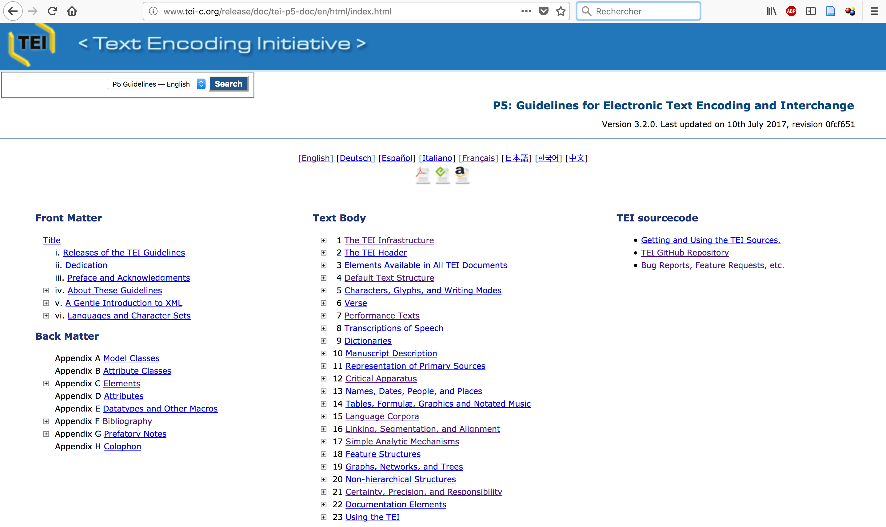
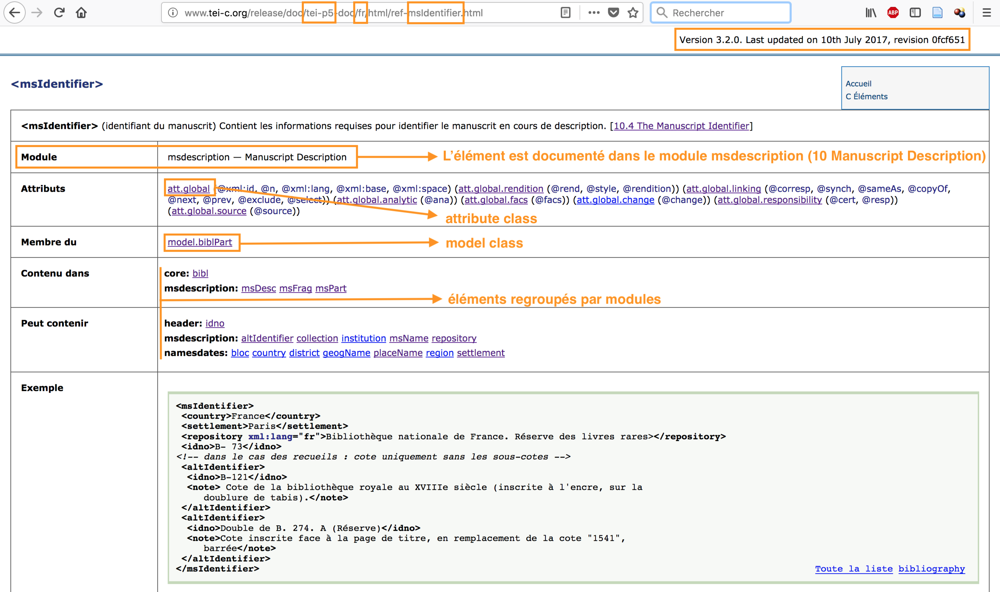

# séance 4 : Les TEIguidelines

L’objectif des **guidelines** de la TEI est de guider les pratiques d’encodage.

---

## Les “principes de Poughkeepsie” (1987)

Les recommandations visent à :

  * Fournir un format standard;  
  * Favoriser l’échange de textes dans les humanités;
  * Suggérer des principes abstraits pour l’encodage des textes;
  * Inclure un ensemble minimal de conventions pour l’encodage de nouveaux textes;
  * Proposer des ensembles de conventions d’encodage adaptés à plusieurs applications différentes.

---

## Comment lire les **guidelines** ?

### La page d'accueil : <http://www.tei-c.org/release/doc/tei-p5-doc/en/html/index.html>

---

### [Lire les spécifications](./img/guidelines_msIdentifier.png)

---
 
### Les modules

Chaque module est documenté par un chapitre des Guidelines.

**4 modules sont obligatoires** (communs à tous les documents TEI) :`

* `tei` : [1 The TEI Infrastructure](http://www.tei-c.org/release/doc/tei-p5-doc/fr/html/ST.html) (définition des classes, macros et types de données)
* `header` : [2 The TEI Header](http://www.tei-c.org/release/doc/tei-p5-doc/fr/html/HD.html) (métadonnées communes)
* `core` : [3 Elements Available in All TEI Documents](http://www.tei-c.org/release/doc/tei-p5-doc/fr/html/CO.html)
* `textstructure` : [4 Default Text Structure](http://www.tei-c.org/release/doc/tei-p5-doc/fr/html/DS.html) (éléments de base pour structurer un texte de type livre)

---

Les modules sont relatifs à un type d'objet, une approche, une discipline, par ex. :

* `analysis` : [analyse linguistique](http://www.tei-c.org/release/doc/tei-p5-doc/en/html/AI.html)
* `drama` : [textes d’art dramatique](http://www.tei-c.org/release/doc/tei-p5-doc/en/html/DR.html)
* `gaiji` : [caractères non standard et glyphes](http://www.tei-c.org/release/doc/tei-p5-doc/en/html/WD.html)
* `linking` : [liens, segmentation, alignements](http://www.tei-c.org/release/doc/tei-p5-doc/en/html/SA.html)
* `msdescription` : [description des manuscrits](http://www.tei-c.org/release/doc/tei-p5-doc/en/html/MS.html)
* `namesdates` : [noms, dates, lieux](http://www.tei-c.org/release/doc/tei-p5-doc/en/html/ND.html)
* `textcrit` : [apparat critique](http://www.tei-c.org/release/doc/tei-p5-doc/en/html/TC.html)
* `transcr` : [transcription des sources primaires](http://www.tei-c.org/release/doc/tei-p5-doc/en/html/PH.html)

---

### Exercice 

Structurer un texte de roman et créer un index des noms de personnages et de lieux

- Structurer le texte de Victor Hugo (VH.txt) dans un fichier XML-TEI ;
- Créer les métadonnées du fichier dans le TEIheader à l'aide des informations suivantes : https://fr.wikisource.org/w/index.php?title=Notre-Dame_de_Paris/Livre_deuxième&printable=yes  ;
- Constituer, à l’aide de TEIguidelines, un index des noms de personnages et de lieux du texte de Victor Hugo. Veillez à expliquer dans des commentaires votre choix de balisage en ajoutant un lien vers la documentation.

