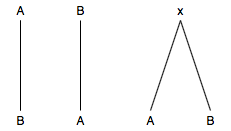

# Séance 6 : Encoder une édition critique 
---
## I-Retour sur les enjeux scientifiques d’une édition numérique
---
BUREAU, Bruno, « Quelques réflexions sur la notion de littérarité à partir de l’édition numérique de commentateurs anciens », *Interférences. Ars scribendi*, janvier 2012, [En ligne : http://journals.openedition.org/interferences/186].

« L’outil numérique questionne non pas tant le livre, ou même le texte, que nos modes habituels de perception de la littérarité. L’outil numérique, parce qu’il questionne notre lecture et le mode même de la lecture, ne ferme pas la porte à la littérarité, il ouvre en réalité des fenêtres sur des formes jusqu’ici restées peut-être plus dans l’ombre de l’analyse littéraire. » 

---
DUVAL, Frédéric, « Pour des éditions numériques critiques. L’exemple des textes français », *Le texte à l’épreuve du numérique*, Presses universitaires de Vincennes, 2017, (« Médiévales »), p. 13‑30.

« La force du numérique est sa modularité : une édition numérique peut proposer des parcours plus ou moins ouverts, de la consultation libre d'un dépôt d'archives à des parcours commandés par des approches et intérêts divers. » 

---

ROBINSON, Peter, « Where We Are with Electronic Scholarly Editions, and Where We Want to Be », *Jahrbuch für Computerphilologie*, vol. 5 / 5, 2003, p. 126‑146.

« On ne peut pas connaître l'oeuvre sans les documents. De même, on ne peut comprendre les documents sans une compréhension de l'oeuvre qu'ils génèrent. On peut en tirer le principe suivant : une édition scientifique doit éclairer autant que possible chaque aspect du texte, aussi bien le texte-comme-oeuvre que le texte-comme-document. Les éditions imprimées traditionnelles se sont davantage intéressées au premier. Un avantage évident des éditions numériques est qu'elles peuvent rééquilibrer le balancier en incluant un matériau bien plus riche pour l'étude du texte-comme-document qu'on ne peut y parvenir par le moyen de l'impression. » 

---

### La critique textuelle

Une édition moderne afin de transmettre un texte compare les manuscrits pour établir le texte original, et rendre compte de cette comparaison dans un apparat critique.

À partir de la comparaison des variantes : on essaie d’établir une généalogie des textes, pour pouvoir déterminer quel témoignage (leçon) est celui qui a le plus de chance d’être équivalent au texte original (archétype).

Pour aller plus loin :  https://collatex.net/doc/

---

## Le principe du stemma

Pour aller plus loin : 
R stemmatology : https://graal.hypotheses.org/665 

---

Pour aller plus loin : BOURGAIN, Pascale et VIELLIARD, Françoise, *Conseils pour l’édition des textes médiévaux. Fascicule III, Textes littéraires*, Paris, France, Comité des travaux historiques et scientifiques : École nationale des chartes, 2018.

---

## II- Encoder une édition critique

* Définir quel type d'édition, on souhaite faire :
	* **Reconstructionniste**, selon la méthode lachmanienne; 
	* **Conservatrice**, selon la méthode bédiériste.
	
* Définir quel type d'apparat on veut constituer :

	* **Apparat exhaustif** : qui présente l’ensemble des variantes;
	* **Apparat sélectif** : qui exclut certains types de variantes jugées moins importantes n'ayant pas d'impact sur le sens (variantes graphiques, séparation des mots, ponctuation).

---

* Définir quelle présentation on souhaite :

	* **Apparat positif**, qui enregistre et fait figurer explicitement les leçons de chaque témoin accompagnée de son sigle ; le plus lourd, mais le plus clair ;
	* **Apparat négatif**, qui ne fait figurer que les témoins dont le texte diffère. Tous les autres, qui ne sont pas signalés, sont supposés porter le texte retenu ;
	* **Apparat mixte**, négatif par défaut qui ne devient positif qu’en cas de besoin de clarification.

---

---

### Les balises XML TEI pour l'édition critique

voir les TEIguidelines, chap. 12 [*Critical Apparatus*](http://www.tei-c.org/release/doc/tei-p5-doc/fr/html/TC.html)

Attention : la méthode utilisée dans les exemples suivants suit les prescriptions de la *parallel segmentation method*.

`<variantEncoding method="parallel-segmentation"
 location="internal"/>`

Pour aller plus loin : Chap 12.2 [*Linking the Apparatus to the Text*](http://www.tei-c.org/release/doc/tei-p5-doc/en/html/TC.html#TCAPLK)

---

**Déclaration des sources dans le `<sourceDesc>` :**
*  `<listWit>` : donne une liste de tous les témoins cités dans un apparat critique;
*  `<witness>` : témoin d'une édition.

`<listWit>`
 `<witness xml:id="C1">Paris, BnF, ms 412</witness>`
 `<witness xml:id="C2">Paris, BnF, ms 411</witness>`
 `<witness xml:id="C3">London, British Library, royal 20 D. VI.</witness>`
`</listWit>`

----

**Constitution de l'apparat critique (1)**

* `<app>` contient une entrée dans un apparat critique, constituée d’un lemme facultatif ou d’au moins une leçon;
* `<lem>`contient le lemme.
* `<rdg>`  contient une variante/leçon du texte;
	* `<app>`
 `<lem wit="#El #Hg">Experience</lem>`
 `<rdg wit="#La" type="substantive">Experiment</rdg>`
 `<rdg wit="#Ra2" type="substantive">Eryment</rdg>`
`</app>`

---
**Constitution de l'apparat critique (2)**

* `<rdgGrp>` regroupe deux leçons ou plus qui sont perçues comme ayant une relation génétique ou une autre affinité; 
	* `<app>`
 `<lem wit="#fr_wit1">comte</lem>`
 `<rdgGrp type="orthographic">`
  `<rdg wit="#fr_wit2">cante</rdg>`
  `<rdg wit="#fr_wit3">contes</rdg>`
 `</rdgGrp>`
`</app>`

---

## III-Mise en pratique

- Structurer le texte du chant I, v.183-222 de la *Pharsale* de Lucain;
- Déclarer dans le teiHeader les différents témoins de la tradition du texte de Lucain à l'aide de la table des sigles;
- Encoder l'apparat critique;
- Utiliser la [TEI Critical Apparatus toolbox](http://teicat.huma-num.fr) pour visualiser votre encodage (rubriques "check my encoding" - "display parallel versions" - "Print an edition").

Aller plus loin : 
- Essayer de déclarer des côtes de manuscrits à jour en vous aidant des catalogues de bibliothèques en ligne;
- Lier quand cela est possible les témoins à une version numérisée.